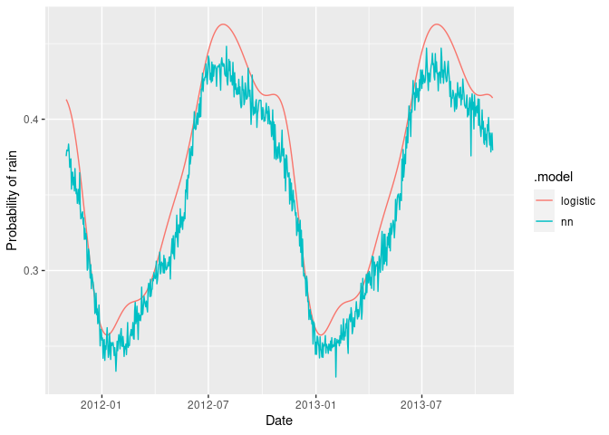

<!-- README.md is generated from README.Rmd. Please edit that file -->

# fable.binary

<!-- badges: start -->

The R package *fable.binary* provides a collection of time series
forecasting models suitable for binary time series. These models work
within the fable framework, which provides the tools to evaluate,
visualise, and combine models in a workflow consistent with the
tidyverse.

## Installation

You can install the **development** version from
[GitHub](https://github.com/robjhyndman/fable.binary)

``` r
# install.packages("remotes")
remotes::install_github("robjhyndman/fable.binary")
```

## Examples

``` r
library(fable.binary)
#> Loading required package: fabletools
library(ggplot2)
library(dplyr)
#> 
#> Attaching package: 'dplyr'
#> The following objects are masked from 'package:stats':
#> 
#>     filter, lag
#> The following objects are masked from 'package:base':
#> 
#>     intersect, setdiff, setequal, union

# Fit models
fit <- melb_rain |>
    model(
        nn = BINNET(Wet ~ fourier(K = 1, period = "year")),
        logistic = LOGISTIC(Wet ~ fourier(K = 5, period = "year"))
    )

# Functions for computing on models
fit |> tidy()
#> # A tibble: 11 × 6
#>    .model   term                           estimate std.error statistic  p.value
#>    <chr>    <chr>                             <dbl>     <dbl>     <dbl>    <dbl>
#>  1 logistic "(Intercept)"                  -0.573      0.0678   -8.45   3.97e-17
#>  2 logistic "fourier(K = 5, period = \"ye… -0.325      0.0966   -3.36   7.84e- 4
#>  3 logistic "fourier(K = 5, period = \"ye… -0.279      0.0952   -2.93   3.43e- 3
#>  4 logistic "fourier(K = 5, period = \"ye… -0.0203     0.0961   -0.211  8.33e- 1
#>  5 logistic "fourier(K = 5, period = \"ye… -0.0312     0.0957   -0.326  7.44e- 1
#>  6 logistic "fourier(K = 5, period = \"ye… -0.0696     0.0960   -0.725  4.69e- 1
#>  7 logistic "fourier(K = 5, period = \"ye… -0.0207     0.0958   -0.216  8.29e- 1
#>  8 logistic "fourier(K = 5, period = \"ye… -0.0342     0.0960   -0.357  7.21e- 1
#>  9 logistic "fourier(K = 5, period = \"ye…  0.0224     0.0958    0.234  8.15e- 1
#> 10 logistic "fourier(K = 5, period = \"ye… -0.0188     0.0956   -0.196  8.44e- 1
#> 11 logistic "fourier(K = 5, period = \"ye…  0.00815    0.0958    0.0851 9.32e- 1
fit |> select(logistic) |> glance()
#> # A tibble: 1 × 15
#>   .model   r_squared adj_r_squared sigma2 statistic p_value    df log_lik   AIC
#>   <chr>        <dbl>         <dbl>  <dbl>     <dbl>   <dbl> <int>   <dbl> <dbl>
#> 1 logistic     0.376         0.375   4.46      260.       0    11  -9358. 6476.
#> # ℹ 6 more variables: AICc <dbl>, BIC <dbl>, CV <dbl>, deviance <dbl>,
#> #   df.residual <int>, rank <int>
fit |> select(logistic) |> report()
#> Series: Wet 
#> Model: LOGISTIC 
#> 
#> Residuals:
#>    Min     1Q Median     3Q    Max 
#> -1.861 -1.655 -1.388  2.363  3.886 
#> 
#> Coefficients:
#>                                        Estimate Std. Error t value Pr(>|t|)    
#> (Intercept)                           -0.573059   0.067825  -8.449  < 2e-16 ***
#> fourier(K = 5, period = "year")C1_365 -0.324774   0.096634  -3.361 0.000784 ***
#> fourier(K = 5, period = "year")S1_365 -0.278737   0.095199  -2.928 0.003430 ** 
#> fourier(K = 5, period = "year")C2_365 -0.020283   0.096138  -0.211 0.832917    
#> fourier(K = 5, period = "year")S2_365 -0.031195   0.095695  -0.326 0.744457    
#> fourier(K = 5, period = "year")C3_365 -0.069556   0.095990  -0.725 0.468726    
#> fourier(K = 5, period = "year")S3_365 -0.020730   0.095831  -0.216 0.828752    
#> fourier(K = 5, period = "year")C4_365 -0.034241   0.095966  -0.357 0.721255    
#> fourier(K = 5, period = "year")S4_365  0.022435   0.095834   0.234 0.814915    
#> fourier(K = 5, period = "year")C5_365 -0.018772   0.095622  -0.196 0.844371    
#> fourier(K = 5, period = "year")S5_365  0.008153   0.095752   0.085 0.932152    
#> ---
#> Signif. codes:  0 '***' 0.001 '**' 0.01 '*' 0.05 '.' 0.1 ' ' 1
#> 
#> Residual standard error: 2.112 on 4311 degrees of freedom
#> Multiple R-squared: 0.376,   Adjusted R-squared: 0.3746
#> F-statistic: 259.8 on 10 and 4311 DF, p-value: < 2.22e-16
fit |> select(nn) |> glance()
#> # A tibble: 1 × 6
#>   .model inputs hidden_nodes weights repeats sigma2
#>   <chr>   <dbl>        <dbl>   <int>   <int>  <dbl>
#> 1 nn          2            2       9      20  0.226
fit |> select(nn) |> report()
#> Series: Wet 
#> Model: BINNET: 2 
#> 
#> Average of 20 networks, each of which is
#> a 2-2-1 network with 9 weights
#> options were -
#> 
#> sigma^2 estimated as 0.2264
augment(fit)
#> # A tsibble: 8,644 x 6 [1D]
#> # Key:       .model [2]
#>    .model Date       Wet   .fitted .resid .innov
#>    <chr>  <date>     <lgl>   <dbl>  <dbl>  <dbl>
#>  1 nn     2000-01-01 TRUE    0.268  0.732  0.732
#>  2 nn     2000-01-02 FALSE   0.267 -0.267 -0.267
#>  3 nn     2000-01-03 FALSE   0.266 -0.266 -0.266
#>  4 nn     2000-01-04 TRUE    0.265  0.735  0.735
#>  5 nn     2000-01-05 TRUE    0.264  0.736  0.736
#>  6 nn     2000-01-06 FALSE   0.263 -0.263 -0.263
#>  7 nn     2000-01-07 FALSE   0.263 -0.263 -0.263
#>  8 nn     2000-01-08 FALSE   0.262 -0.262 -0.262
#>  9 nn     2000-01-09 FALSE   0.262 -0.262 -0.262
#> 10 nn     2000-01-10 TRUE    0.261  0.739  0.739
#> # ℹ 8,634 more rows

# Produce forecasts. For neural network, use 
fc <- forecast(fit, h = "2 years")
as_tibble(fc) |>
    ggplot(aes(x = Date, y = .mean, col = .model)) +
    geom_line() +
    labs(y = "Probability of rain")
```


